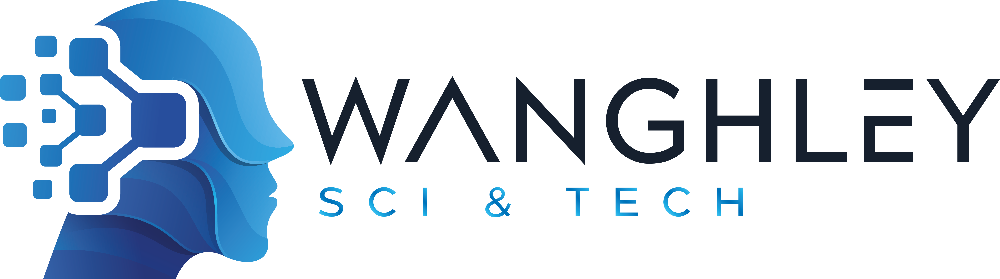

  
  <h1>Hey, I’m <a href="https://wanghley.com">Wanghley Soares Martins</a> 👋</h1>
  
  

  <h4>⚙️ Maker • 🧠 AI & Firmware Engineer • 🔌 IoT + HW/SW Co-Designer • 💻 Full Stack Dev</h4>
  <h4>🌎 Brasília, Brazil ⇄ Durham, NC, USA</h4>

  
  
  

---

<h5 align="center"><i>⚡ Turning circuits into smart systems, bridging wires and algorithms, building for health-tech and real-world impact ⚡</i></h5>

---

### 👨🏽‍💻 About Me

- 🎓 Pursuing B.S.E. in Electrical & Computer Engineering (Concentration: Machine Learning) + B.S. in Computer Science + Certificate in Innovation & Entrepreneurship at Duke University. :contentReference[oaicite:1]{index=1}  
- 🏠 From Brasília, DF, Brazil. Now based in Durham, NC, USA. :contentReference[oaicite:2]{index=2}  
- 💾 Self-taught programming since age 9; graduated as Informatics Technician at the Federal Institute Brasília. :contentReference[oaicite:4]{index=4}  
- 🧬 Focused on **health-tech**, **edge AI**, **neuromorphic computing**, and full-stack + embedded hardware/software co-design.  
- 🛠 I build IoT systems: sensors ↔ firmware ↔ cloud ↔ inference — all integrated end-to-end.  
- 🌱 Maker mindset: from PCB design & embedded firmware to algorithms and backend dashboards — I’m where hardware meets code.

---

### 🔧 My Maker & Engineering Focus

- **Firmware & Embedded Hardware**: microcontrollers, PCB layout (Eagle/Altium), sensor networks, low-power systems.  
- **Edge AI & Neuromorphic Computing**: on-device inference, neuromorphic architecture research, embedded computer-vision/ML at the edge.  
- **IoT & Co-Design**: Designing systems where hardware and software are developed in concert — sensors + algorithms + deployment.  
- **Full-Stack Software & Data Systems**: Front-end dashboards, backend services, data pipelines, cloud/edge integration.  
- **Health Applications**: Applying the entire stack (hardware + AI + software) to healthcare use-cases and impactful systems.

---

  
<h2>📊 GitHub Stats</h2>

  |  |  |  |
  | :-: | :-: | :-: |

  |  |  |
  | :-: | :-: |

---

  
<h2>🛠️ Favorite Tools & Tech Stack</h2>

#### 👨‍💻 Languages  

  
  
  
  

#### 🧰 Frameworks & Embedded  

  
  
  
  
  
  

#### 🧮 Data & Databases  

  
  
  
  
  

#### ☁️ Cloud & DevOps  

  
  
  
  
  
  

---

## 🔭 What I’m Working On  
- Prototyping embedded-AI systems for IoT and health-tech: sensors + firmware + edge inference stacks.  
- Developing neuromorphic computing workflows and integrating them into real-world applications (especially in healthcare and monitoring).  
- Leading full-stack HW/SW co-design projects: from hardware design to firmware to cloud/dashboard.  
- Exploring and building with co-design mindset: bridging electrical & computer engineering with software, AI, and health-applications.  
- Currently a Karsh International Scholar at Duke University. :contentReference[oaicite:5]{index=5}  
- My blog reflects these projects and explorations — check out updates at [wanghley.com](https://wanghley.com) for deep dives and experiments. :contentReference[oaicite:6]{index=6}

---

## 🤝 Let’s Connect  
I’m always open to collaboration, hackathons, maker challenges, and bold hardware/software + AI systems.  
📧 Contact: me@wanghley.com  
Feel free to say hi if you’re into embedded systems, IoT, health-tech, neuromorphic computing or just want to build something off the beaten path.

---

<h3 align="center">Made with ❤️ by Wanghley</h3>  
<h1 align='center'>⚡ <i>Stay curious. Stay hacking.</i> ⚡</h1>
